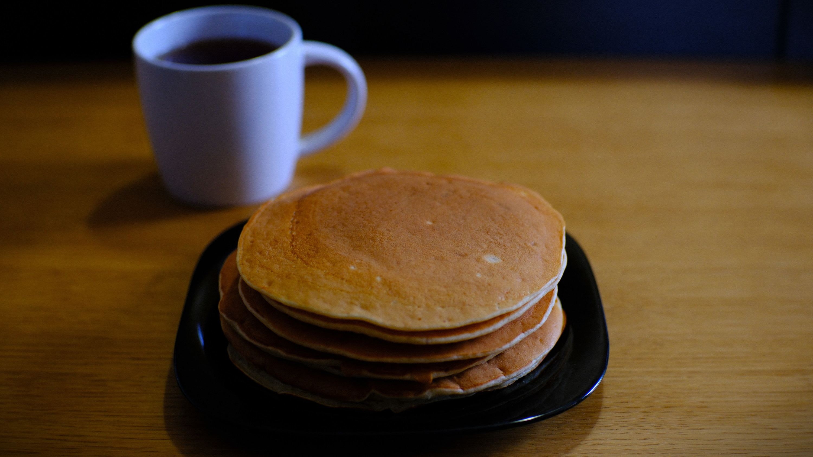

---
tags:
  - 20 минут
  - На двоих
  - Венчик / Миксер
description:
---
# Банановые панкейки

<figure markdown="span">
  
  <figcaption>Банановые панкейки</figcaption>
</figure>

Банановые панкейки — отличный вариант сладкого завтрака. По сути, это обычные панкейки, но с банановым вкусом и ароматом. В этом рецепте довольно много банана, поэтому вкус получается мощный, насыщенный.

## Инвентарь

- Венчик или миксер чтобы смешать ингредиенты

Если этого нет, можно мешать и вилкой.

## Ингредиенты

- Банан 200 гр
- Мука 150 гр
- Молоко 150 гр
- Сахар 1 ч л
- Яйцо куриное 1 шт
- Масло растительное 30 гр
- Разрыхлитель 1,5 ч л
- Соль 1/2 ч л

Добавки:

- Мед, варенье, сироп агавы, кленовый и любые другие сиропы 
- Мягкие фрукты: персик, банан, груша
- Дробленые орехи
- Голубика, малина и другие ягоды

## Способ приготовления

1. В отдельной миске готовишь муку: просеиваешь муку, чтобы обогатить её кислородом,добавляешь разрыхлитель и перемешиваешь.
1. В большой миске разминаешь банан, добавляешь туда яйцо, соль, сахар и растительное масло. Тщательно перемешиваешь до объединения ингредиентов с помощью миксера, венчика или той же вилкой.
1. Добавь к бананам теплое молоко (комнатной температуры или чуть больше). Можешь подогреть в микроволновке. Теплое молоко нужно, чтобы ингредиенты лучше смешались. Мешай смесь до тех пор, пока не растворится сахар.
1. Теперь добавляй заранее подготовленную муку. Перемешивай до объединения ингредиентов. Тесто готово.
1. Печь будем на сухой сковороде без добавления масла, именно отсутствие масла на сковороде делает панкейки такими равномерно румяными.
1. На нагретую сковороду выливай примерно полполовника теста в середину сковороды. Средний диаметр панкейка 10-12 см.
1. Переворачивай, когда тесто сверху подсохло и на поверхности налитого теста начали появляться пузыри. Это занимает примерно 1,5-2 минуты.
1. Вторая сторона выпекается еще где-то с минуту. Чтобы проверить, хорошо ли пропекается панкейк, разломи один и посмотри, не осталось ли внутри сырого теста. На разломе должно быть видно, что блинчик пропёкся и равномерно поднялся.
1. Приготовь любимые добавки и к столу! Банановые панкейки готовы! 

Приятного аппетита!

## Ответы на вопросы

1. 200 грамм бананов — это примерно 2 небольших банана или один очень большой.
1. Бананы для рецепта лучше выбирать перезревшие, у которых на кожуре темные пятна. Они наиболее сладкие и мягкие, отлично разминаются ложкой.
1. Вместо молока можно брать растительное молоко, это не запрещено.
1. Лучше, если ингредиенты будут комнатной температуры. Тепло отлично объединяет продукты. А еще, если тесто тёплое, то сковорода не остывает в тот момент когда на неё выкладываешь тесто и панкейки начинают сразу подниматься и становятся пышнее. 
1. Если снизу панкейк уже начинает подгорать, а сверху ещё совсем жидкий — снижай мощность плиты. Ну и соответственно наоборот, если он уже весь пропёкся, а снизу совсем светлый, увеличь нагрев. 
