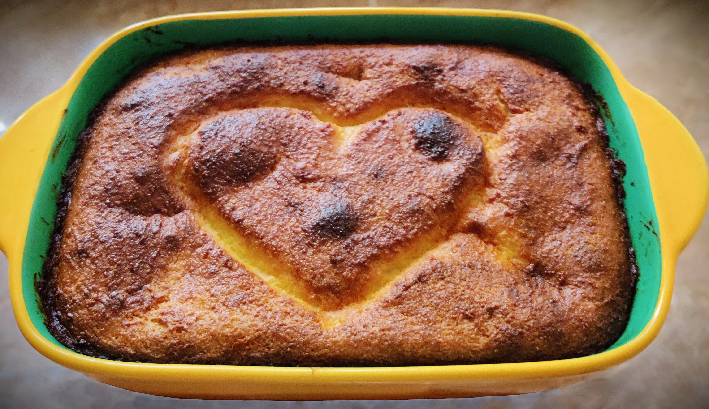

---
tags:
  - 25 минут
  - На двоих
  - Духовка / аэрогриль
description:
---
# Творожная запеканка

<figure markdown="span">
  
  <figcaption>Творожная запеканка</figcaption>
</figure>

## Инвентарь

- Духовка или аэрогриль

## Ингредиенты

- Творог 200 гр
- Яйцо куриное 1 шт
- Манная крупа 3 ст л
- Соль 1/3  ч л
- Сливочное масло для смазывания формы

По желанию: 
- Изюм 1 горсть
- Ванильный сахар 1/2 чл
- Цедра апельсина или лимона 1/2-1 ч л

## Способ приготовления

1. Если делаешь в духовке, то предварительно разогрей духовку до 180°C.
2. В глубокой миске смешай творог, яйцо, манную крупу, соль. Тщательно перемешай до однородной массы.
1. Придай дополнительный вкус: добавь в смесь ванильный сахар, цедру апельсина или лимона. Можно добавить изюм.
3. Смажь форму для запекания сливочным маслом.
4. Выложи творожную массу в смазанную маслом форму и разровняй поверхность.
5. Выпекай до золотистой корочки: в разогретой духовке 25 минут или в аэрогриле минут 25 при 180℃.
6. Достань запеканку из духовки и дай ей немного остыть перед подачей. 

Приятного аппетита! Запеканка отлично заходит и в холодном, и в горячем виде. Мне нравится со сгущенкой, вареньем, или сиропом агавы.

## Ответы на вопросы

1. Если ты живешь не в России, найти творог довольно сложно. Если хочешь приготовить запеканку в других странах, надо искать несоленый молодой сыр, он максимально похож по консистенции на творог.
1. Творог нужен не очень жидкий, в идеале не зернистый.
1. Если творог жидкий, можно отжать через сито. 
1. Я готовлю без сахара, но можешь добавить 1/2 ст л сахара, если любишь сладкое.
1. Сливочное масло можно заменить на кокосовое - будет легкий привкус кокоса в готовой запеканке.