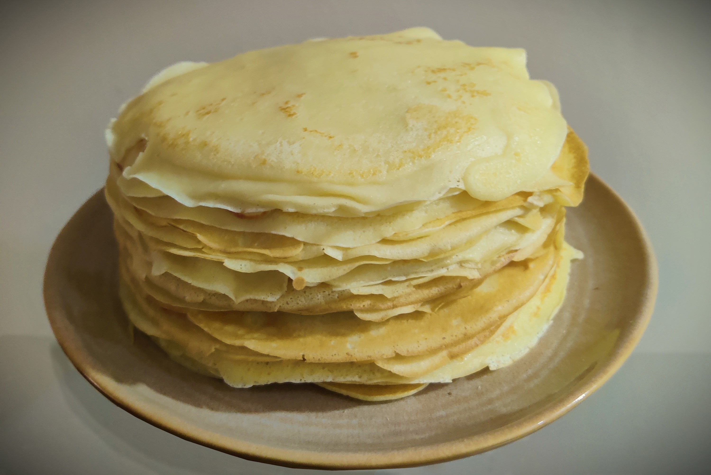

---
tags:
  - 15 минут
  - На двоих
  - Венчик/Миксер
  - Блинная сковорода
description: Заходи чтобы узнать проверенный рецепт тонких блинчиков на молоке. Получатся с первого раза!
---
# Тонкие блины на молоке

<figure markdown="span">
  
  <figcaption>Тонкие блины на молоке</figcaption>
</figure>
## Инвентарь

- Венчик или миксер для взбивания
- Блинная сковорода

## Ингредиенты

- Молоко 500 мл
- Яйца 3 шт
- Мука 200 гр
- Масло растительное 30 гр (2 ст. ложки)
- Сахар 30 гр (2 ст. ложки)
- Соль 2-3 гр (1/2 ч. ложки)

## Способ приготовления

1. Яйца разбиваешь в ёмкость для взбивания. Добавляешь сахар, соль. Перемешиваешь до однородности миксером, венчиком или просто вилкой. Не взбивай сильно, тебе нужно лишь перемешать до однородного состояния и полного растворения сахара и соли.
2. Добавляй в смесь 100-150 мл молока, перемешивай. Не добавляй сразу всё молоко, потому что густое тесто проще промешать так, чтобы не было комочков.
3. Время добавлять муку, порциями добавляй все 200 гр и перемешивай. Лучше просеивать муку в ёмкость с тестом.
4. Теперь доливай оставшееся молоко и снова перемешивай.
5. Добавляй растительное масло (30 гр или 2 ст ложки) в тесто. 
6. Хорошо разогревай сковороду, потому что именно на раскалённой сковороде получаются пористые блины, с дырочками. Первый раз можно капнуть немного масла, дальше должно хватить того масла, что ты добавил в тесто.
7. Наливай тесто на раскалённую сковородку и одновременно вращай её по кругу так, что бы тесто покрыло дно ровным тонким слоем. Ты поймешь нужное количество теста, чтобы хватило сразу на всю сковороду.
8. Переворачивай блин когда тесто сверху схватится и перестанет быть липким, а края начнут чуть-чуть темнеть. Поддень блин лопаткой и аккуратно переверни на другую сторону. Расправь блинчик на сковороде, если он перевернулся неровно. Жди еще буквально полминуты-минуту (зависит от нагрева сковороды) и снимай блин с огня. Проверить готова нижняя сторона или нет можно поддев лопаточкой край блина. Складывай блины на широкую тарелку красивой стопкой.
9. Ешь блины сразу, пока они горячие, со сметаной, сгущёнкой, мёдом, вареньем или любыми другими начинками, которые тебе нравятся. Также можно сделать начинку из творога или мясного фарша, или сделать блин с ветчиной и сыром.

Приятного аппетита!

## Ответы на вопросы

1. Муку лучше просеивать. Это помогает насытить муку кислородом и очистить её от возможных примесей, поэтому рекомендую не пропускать этот пункт.
2. Тесто должно получиться довольно жидкое, примерно как жирные сливки. Если тесто получилось очень густое, добавьте немного воды или молока, если же оно жидкое — добавьте немного муки.
3. Блинная сковорода лучше и равномернее нагревается, но если её нет - жарь на обычной, лучше толстостенной и широкой.
4. На плохо разогретой сковороде дырочек на блине у тебя не получится.
