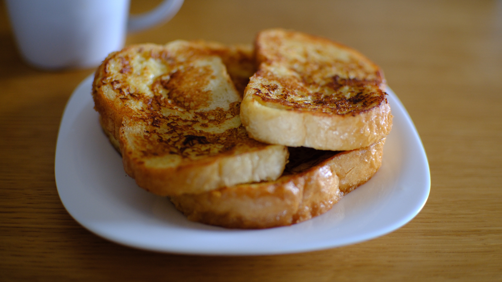

---
tags:
  - 15 минут
  - На двоих
  - Венчик
description:
---
# Сладкие гренки

<figure markdown="span">
  
  <figcaption>Сладкие гренки из белого хлеба</figcaption>
</figure>

Если у тебя много белого хлеба, который уже начинает подсыхать, самое время сделать из него сладкие гренки. Это просто, быстро и  вкусно, отличный вариант быстрого сладкого к чаю.

## Инвентарь

- Венчик, чтобы взбить смесь

Можно и вилкой, но менее удобно.

## Ингредиенты

- Белый хлеб тостами
- Яйцо 1 шт
- Молоко 150 мл
- Сахар 1 ч л
- Соль 1/4 ч л
- Растительное масло для жарки
- Кусочек сливочного или кокосового масла для жарки

Также по желанию можно добавить корицу, мускатный орех, или ванильный сахар.

## Способ приготовления

Для гренок лучше брать не свежий, подсохший хлеб. Свежий может быстро размокнуть и развалиться, а подсохший хорошо держит форму. 

1. Смешай в миске яйцо, сахар и соль до объединения ингредиентов.
1. Влей в смесь молоко и размешай.
1. Прогрей сковороду, налей немного растительного масла и добавь в него кусочек сливочного. Сливочное масло не будет гореть, т.к. его предельные температуры горения выше, чем у сливочного. А сливочное масло придаст гренкам сливочный вкус. Вместо сливочного и растительного масла можно использовать кокосовое, тогда у гренок будет лёгкий привкус кокоса.
1. Опусти гренки на 2-3 секунды в молочно-яичную смесь, дай стечь лишней жидкости. 
1. Жарь по 1,5-2 минуты на среднем огне, чтобы у гренки получилась хрустящая корочка, но она осталась мягкой внутри.
1. Когда появится приятная корочка, гренки готовы, снимай с огня. Они вкусны как в горячем, так и в холодном виде. Можно подать с фруктами, взбитыми сливки или съесть просто так.

Приятного аппетита!
