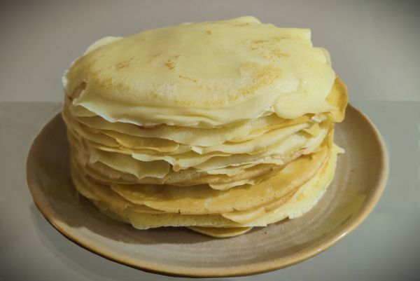

---
hide:
  - feedback
---
# Завтраки

Завтрак является важной частью нашего питания, поскольку он предоставляет организму энергию на начало дня. Правильно сбалансированный завтрак помогает лучше сосредоточиться и продуктивно работать. Завтрак способствует улучшению настроения и повышению общего благополучия. 

Регулярное питание с утра помогает поддерживать здоровый метаболизм и контролировать вес. Таким образом, включение завтрака в рацион питания считается важным для общего здоровья и хорошего самочувствия.

Не пренебрегай завтраком, а лучше начни с выбора рецепта.

## Блюда из яиц

-   [Яичница-глазунья](fried-eggs.md)

    ---

    

-   [Омлет](omelet.md)

    ---

    

-   [Яйцо-пашот](pashot.md)

    ---

    

## Блины и оладьи

-   [Тонкие блинчики](creppe.md)

    ---

    

-   [Оладушки на кефире](oladji.md)

    ---

    

-   [Банановые панкейки](banana-pancakes.md)

    ---

    

-   [Овсянушек](ovsyanushek.md)

    ---

    

## Каши

-   [Овсяная каша](oat-porridge.md)

    ---

    

-   [Полента с плавленным сыром](polenta.md)

    ---

    

-   [Манная каша](manka.md)

    ---

    

## Из творога

-   [Сырники](syrniki.md)

    ---

    

-   [Творожная запеканка](cottage-cheese-casserole.md)

    ---

    

## Бутерброды и тосты

-   [Горячий бутерброд с сыром](cheese-toast.md)

    ---

    

-   [Сладкие гренки](grenki.md)

    ---

    

-   [Тосты с авокадо и яйцом пашот](toast-with-avocado-and-pashot.md)

    ---

    

-   [Тосты с прошутто и вялеными томатами](toast-with-proshutto-and-dried-tomatos.md)

    ---

    

