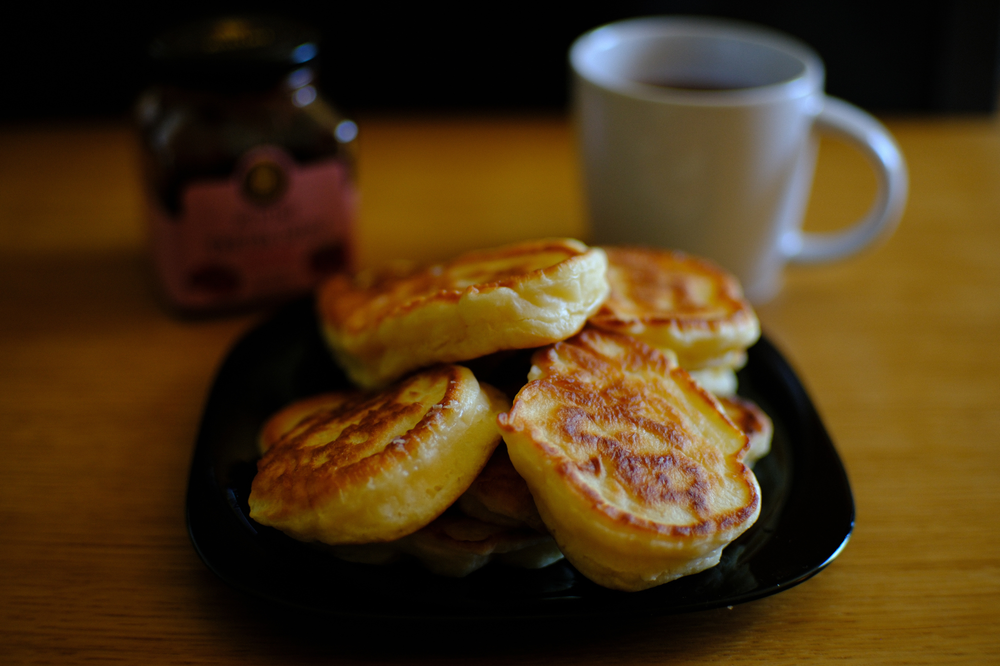

---
tags:
  - 15 минут
  - На двоих
  - Миксер
description:
---
# Оладушки на кефире

<figure markdown="span">
  
  <figcaption>Оладушки</figcaption>
</figure>

Описание рецепта

## Инвентарь

- Миксер или венчик

## Ингредиенты

- Кефир 250 г
- Яйцо 1 шт
- Мука 220-240 г
- Сахар 1 ч л
- Соль 1/4 ч л
- Сода 1/4 ч л
- Масло растительное для жарки

## Способ приготовления

1. todo
1. todo

Приятного аппетита!