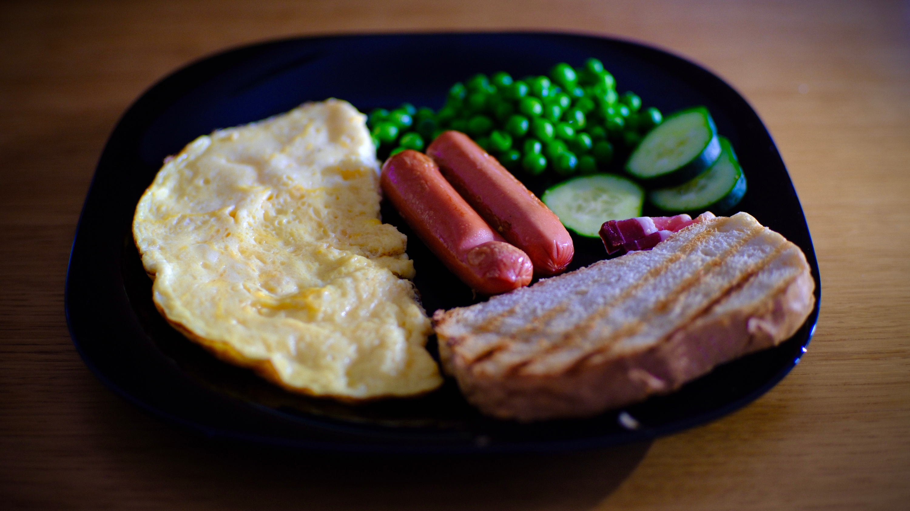

---
tags:
  - 15 минут
  - На одного
  - Без техники
description: Объемный
---
# Омлет

<figure markdown="span">
  
  <figcaption>Омлет с сосисками и зеленым горошком</figcaption>
</figure>

## Инвентарь

- Вилка или венчик, для взбивания

## Ингредиенты

Основные:

- Яйцо куриное 2 шт
- Молоко 60 мл
- Соль 1/4 ч л
- Растительное масло для жарки

Добавки:

- Что-то мясное: ветчина, сосиски, вареная курица, колбаса и так далее
- Что-то сырное: белый сыр типа фета или желтый сыр любой твердости, который можно потереть (гауда, пармезан, чеддер и так далее)

## Способ приготовления

1. Возьми глубокую миску, разбей туда яйца, добавь молоко и соль. Взбей вилкой или венчиком до состояния "ингредиенты смешались". Совсем однородно можно не смешивать, я, например, люблю текстурный омлет, когда он разной плотности.
1. Также в смесь можешь добавить мясные или сырные добавки, вкус от этого только улучшится.
1. На разогретую сковороду наливаешь растительное масло, выливаешь смесь, закрываешь крышкой и ставишь на слабый огонь. Готовь до тех пор, пока омлет не схватиться сверху. Время готовки зависит от плиты, сковороды и количества смеси, но ориентировочно это 5-10 минут.

## Ответы на вопросы

1. База для приготовления омлета такая: на 1 яйцо нужно 30 мл молока. Лучший вариант это молоко, но может быть и вода, и сливки, и растительное молоко.  
1. Диаметр сковороды зависит от количества порций. Смесь должна быть по высоте не больше 1-1,5 см, иначе снизу подгорит, а сверху не пропечется.
1. Да, можно добавить любые приправы: соль, итальянские травы, базилик, что угодно на свой вкус.
1. Если омлет снизу уже подгорает, а сверху еще жидкий (смесь не схватилась), то лучше переверни его, чтобы спасти.

Приятного аппетита!