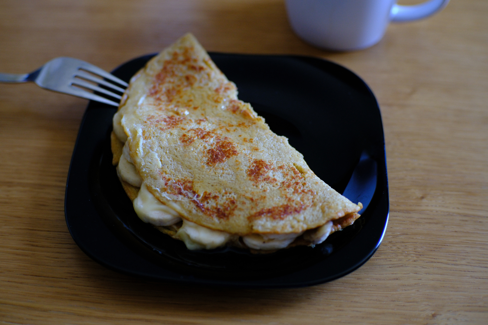

---
tags:
  - 15 минут
  - На одного
  - Блендер
description:
---
# Овсянушек

<figure markdown="span">
  
  <figcaption>Овсянушек с бананом и шоколадным сиропом</figcaption>
</figure>

Овсянушек, или овсяноблин, это быстрый и полезный завтрак из перемолотых овсяных хлопьев.

## Инвентарь

- Блендер - чтобы смешать ингредиенты

## Ингредиенты

**Для блина**:

- Овсяные хлопья длительной варки 40 гр
- Молоко 40 гр
- Яйцо куриное 1 шт
- Соль 1/4 ч л

**Для начинки**:

- Банан 1/2 шт
- Сыр
- Сироп (шоколадный, карамельный, кленовый, сироп агавы и тд)

## Способ приготовления

1. Засыпь все ингредиенты в блендер: овсяные хлопья, молоко, яйцо и соль. Перемешай блендером чтобы получить тесто.
1. На сковороду примерно 24 см диаметром вылей тесто одной порции. Жарить надо до момента пока верхняя часть не схватиться.
1. Переверни блин. Насыпь начинку -- тертый сыр и бананы. Сложи блин пополам. Пожарь на одной стороне 1-2 минуты, переверни и дожарь на другой 1-2 минуты. Это нужно, чтобы сыр расплавился.
1. Выложи на тарелку. Перед подачей полей сиропом.

Приятного аппетита!