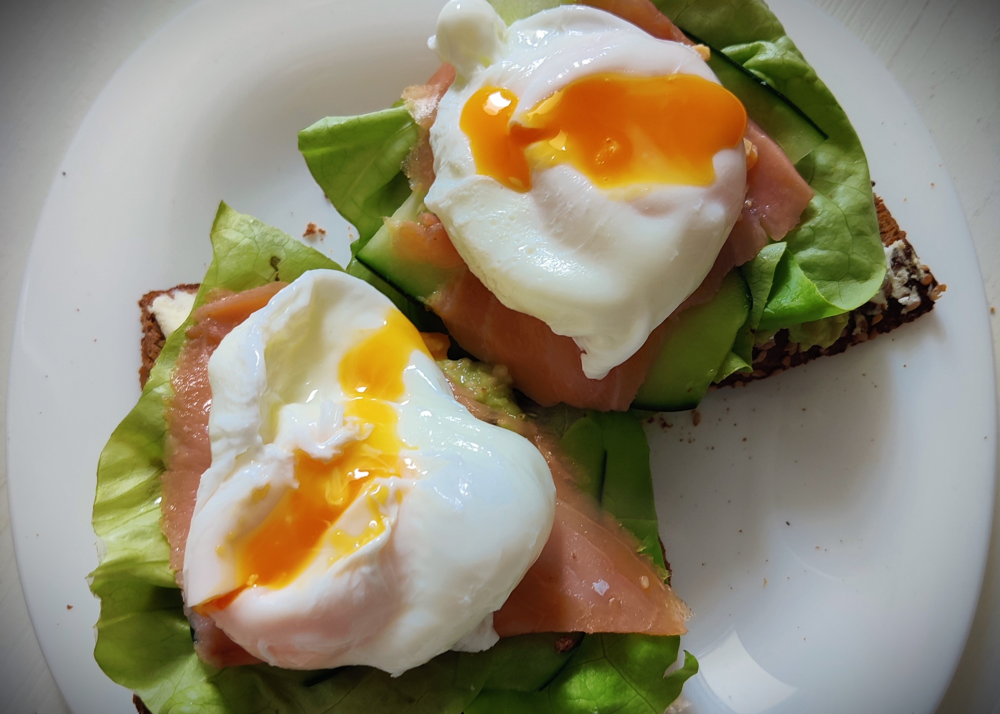

---
tags:
  - 15 минут
  - На двоих
  - Гриль / тостер
description:
---
# Тосты с авокадо и яйцом пашот

<figure markdown="span">
  
  <figcaption>Тосты с яйцом пашот, авокадо и красной рыбой</figcaption>
</figure>

Когда ты уже научился готовить [идеальное яйцо пашот](pashot.md), то самое время научиться подавать невероятно красивый тост. Лучшее сочетание, на мой взгляд, это яйцо, авокадо и красная слабосоленая рыба (это может быть форель, лосось, нерка, какая угодно). 

## Инвентарь

- Скоровода, тостер или гриль - чтобы подсушить хлеб

## Ингредиенты

- Ржаной или зерновой хлеб 2 куска
- [Яйца пашот](pashot.md) 2 штуки
- Красная слабосоленая рыба (нерка, форель, семга и тд)
- Спелое авокадо
- Творожный сыр
- Листья салата
- Черный перец
- Соль
- Сок лимона

## Способ приготовления

1. Подсуши хлеб любым удобным способом, чтобы он не размок от намазок.
1. Возьми спелое авокадо. Спелое авокадо это мягкое авокадо. Не готовь из неспелого, потому что оно будет горчить. Разрежь авокадо пополам, столовой ложкой отдели от кожуры, со спелым авокадо это легко. 
1. Разомни половину авокадо в пюре. Половинки авокадо хватает где-то на четыре средних бутерброда, поэтому, вероятно, вторую половину лучше не трогать, а то будет много. Добавь соль, перец и лимонный сок. Сок подойдет и покупной из бутылки, и из свежего лимона. Из второй половины можно сделать [тосты с прошутто и вялеными томатами](toast-with-proshutto-and-dried-tomatos.md).
1. Подготовка завершена, собираем бутеброд: подсушенный хлеб намажь творожным сыром, сверху выложи пюре из авокадо, затем листья салата, красную рыбу и, наконец, горячее яйцо пашот. В таком порядке слои будут максимально стабильными и не будут сильно скользить друг по другу.
1. При подаче слегка надрежь яйцо, чтобы показался желток. Ешь бутеброд пока яйцо горячее!

Приятного аппетита!