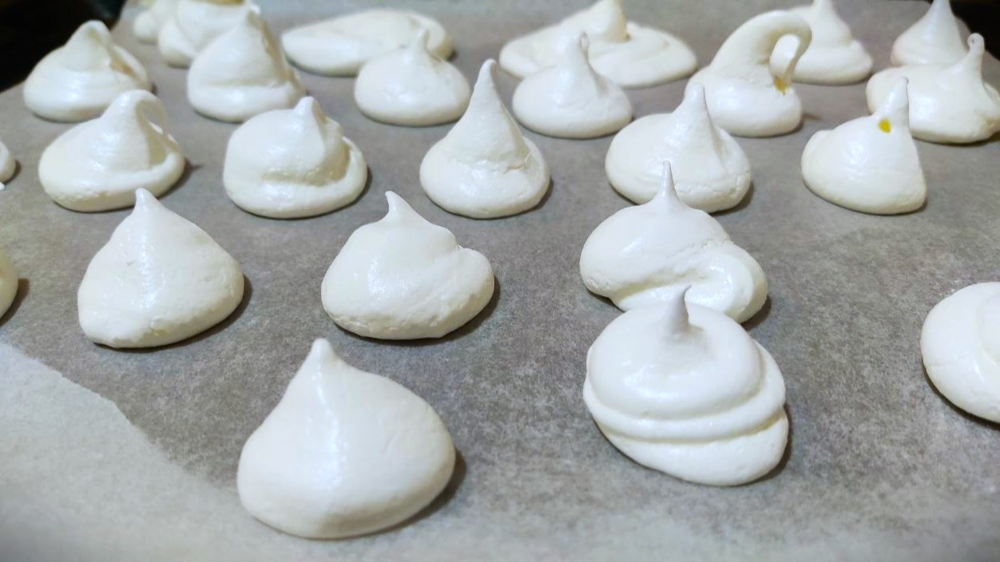
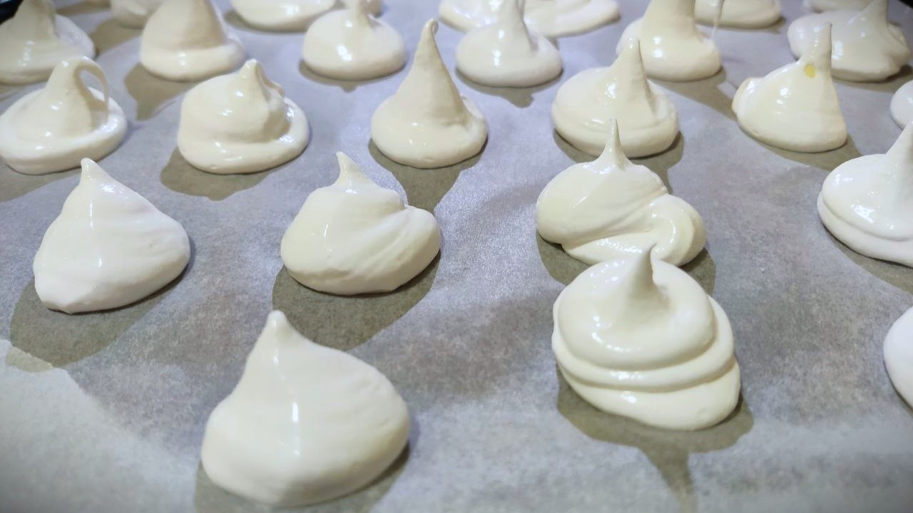

---
tags:
  - 90 минут
  - На двоих
  - Миксер
  - Духовка
description:
---
# Безе

<figure markdown="span">
  
  <figcaption>Готовое безе</figcaption>
</figure>

Безе -- это десерт из взбитых яичных белков и сахара. Десерты безе обычно легкие и воздушные, с хрустящей внешней стороной и мягкой, похожей на зефир внутренней частью. 

На приготовление безе потребуется 10-15 минут, остальное время -- это время приготовления в духовке.

## Инвентарь

- Миксер - без миксера не получишь хороший результат, взбить вручную до нужной консистенции довольно долгое и неблагодарное занятие.
- Духовка
- Бумага для выпечки

## Ингредиенты

На 30 штук безе:

- Яйца 2 шт
- Сахар или сахарная пудра 120 гр
- Сок лимона 5-7 капель
- Соль 1 щепотка

## Способ приготовления

Безе -- довольно капризный рецепт, поэтому обращай внимание на все замечания и комментарии, это важно.

И первый комментарий будет про яйца. Яйца для безе лучше брать не самые свежие, где-то недельной давности. Такие яйца лучше держат форму. Плюс яйца должны быть охлажденные, из холодильника, так они лучше взбиваются.

1. Первым шагом отдели белки от желтков. Я обычно это делаю через половинки скорлупы, переливая желток туда-обратно, пока белок сливается в емкость. Есть много разных способов, поищи в интернете подходящий для себя, если моим способом не получается. Ни капли желтка не должно попасть в белки, иначе белок не взобьется.
1. Белки дадут довольно пышную пену, поэтому нам нужна глубокая или высокая емкость. Емкость должна быть сухая и не жирная, капли воды или масла помешают образованию пены. Добавь щепотку соли и взбивай белки миксером на средней скорости. Капни пару капель лимонного сока, это поможет стабилизировать белки.
1. Когда белки взобьются, начинай подсыпать сахарную пудру. Можно взять и сахар, но с пудрой безе получится более гладким и сахар не будет ощущаться в получившемся тесте. Взбивай, пока не всыпешь весь сахар/пудру. Взбивай в сумме минут 7-10. В тесте не должно остаться никаких пузырьков воздуха, идеальная глазированная поверхность. 
1. Разогрей духовку до 100℃.
1. Теперь надо высадить белки на противень. Застели противень бумагой для выпечки и высади небольшие безе диаметром 2-3 сантиметра. Самый простой вариант сделать это ложкой. Но удобнее и красивее сделать используя кондитерские мешки. Можно воспользоваться плотным пакетом: наложить туда тесто, завязать край, а потом отрезать кончик. Должно получиться примерно так:
   
    

1. Уменьши температуру духовки до 80-90℃ и поставь безе в духовку. Температура нужна низкая, чтобы безе не сгорели и не стали желтыми. Время приготовления зависит от мощности духовки. Я рекомендую поставить таймер на час, потом проверить на одном безе что получилось и доготовить. У меня готовка занимает примерно 1 ч 30 мин - 1 ч 40 мин.
1. Готовые безе получаются белоснежные, хрустящие снаружи и немного влажные внутри. Хранятся они где-то неделю в сухом прохладном месте, но обычно съедаются гораздо быстрее.

Приятного аппетита!

Безе можно есть просто так, а можно приготовить различные десерты на его основе. Например, пироженое "[Графские развалины](grafskie-razvaliny.md)".