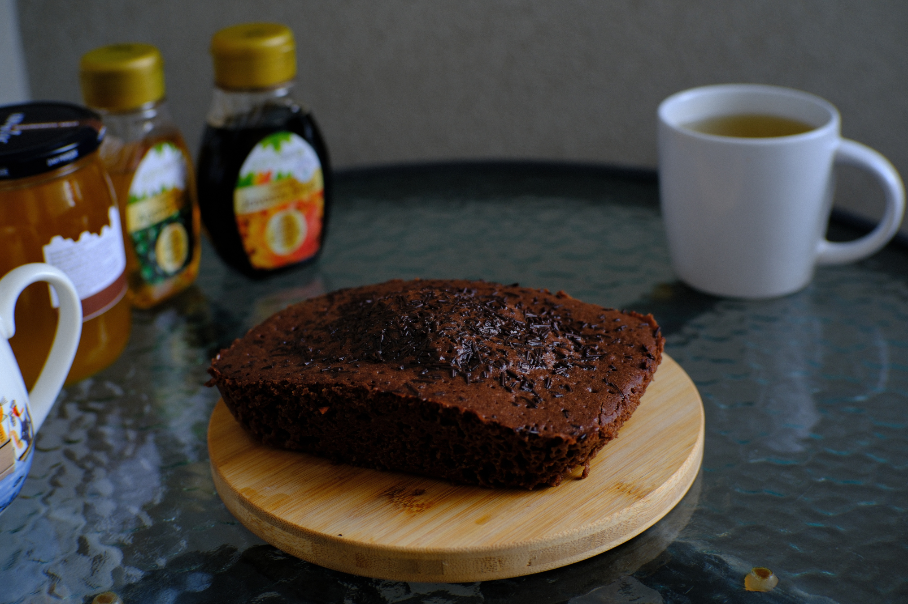

---
tags:
  - 10 минут
  - На двоих
  - Микроволновка
description:
---
# Кекс в микроволновке

<!-- <figure markdown="span">
  
  <figcaption>Кекс в микроволновке</figcaption>
</figure> -->

Очень вкусный, мягкий кекс, с изумительной текстурой и вкусом шоколада. На всё это тебе нужно всего лишь 10 минут: 7 минут на смешивание ингредиентов и 3 минуты на выпекание. Идеально, когда хочется выпечки.

## Инвентарь

- Вилка, венчик или миксер
- Форма в чем запечь - кружка, небольшая форма для выпечки, стеклянный контейнер и тд
- Микроволновка

## Ингредиенты

- Мука пшеничная 70 г
- Какао-порошок 15 г
- Сахарная пудра или сахар 40 г
- Яйцо 1 шт
- Молоко 40 г
- Масло подсолнечное рафинированное 30 г
- Разрыхлитель для теста 2 г
- Соль 1/2 ч л

## Способ приготовления

1. Смешай сухие ингредиенты: муку, какао-порошок, сахар или сахарную пудру, разрыхлитель, соль.
1. Добавь в сухую смесь яйцо, молоко и растительное масло. Смешай всё до однородности, тесто должно быть похоже по консистенции и цвету на растопленный шоколад.
1. Переложи в форму и выпекай в мироволновке 3 минуты. Учти, что кекс поднимается, поэтому форму заполняй наполовину.
1. Кекс готов. Вкусно полить свежий кекс каким-нибудь сладким сиропом. Я люблю сироп агавы, кленовый или шоколадный. А еще можно положить мороженое.

Приятного аппетита!