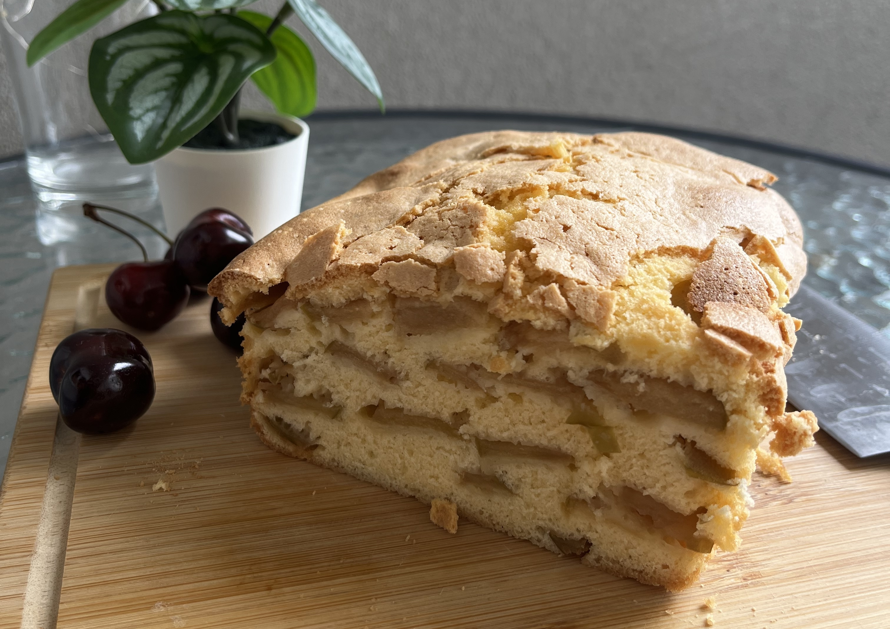

---
tags:
  - 15 минут
  - На компанию
  - Духовка
description:
---
# Шарлотка

<figure markdown="span">
  
  <figcaption>Шарлотка в разрезе</figcaption>
</figure>

Вкусная и быстрая яблочная шарлотка.

## Ингредиенты

- Яблоки кислых сортов 2-3 шт
- Яйца 4 шт
- Сахар 160 гр
- Мука 160 гр
- Соль 1/4 ч л

## Способ приготовления

1. Подготавливаешь яблоки - моешь, удаляешь сердцевину, режешь тонко дольками.
1. В миске растираешь яйца и сахар в светлую густую массу. Чтобы убедиться, что масса уже хорошо взбилась, проведи линию венчиком. Если она остаётся видимой в течение 1-2 секунд, а потом растекается, это значит, что яйца с сахаром хорошо взбиты. 
1. Постепенно добавляй муку в тесто. Тут главное сохранить воздушность. Перемешиваем аккуратно с помощью лопаточки или вилки. На этом этапе можно добавить корицу, если нравится вкус и аромат. Яблоки с корицей - отличное сочетание.
1. Застилай форму для выпечки пергаментной бумагой, чтобы было проще достать готовый пирог.
1. В форму выкладывай слой яблок, заливай тестом. Опять слой яблок, снова тесто и так пока тесто не закончится.
1. Выпекай яблочную шарлотку в разогретой духовке при температуре 180℃ примерно 30-40 минут. Ориентируйся на аромат выпечки и на корочку - пирог должен стать золотисто-коричневым.
1. Достань из формы, дай подостыть. Отлично заходит с несладкими напитками типа [чая](../drinks/tea/index.md) или [кофе](../drinks/coffee/index.md).

Приятного аппетита!