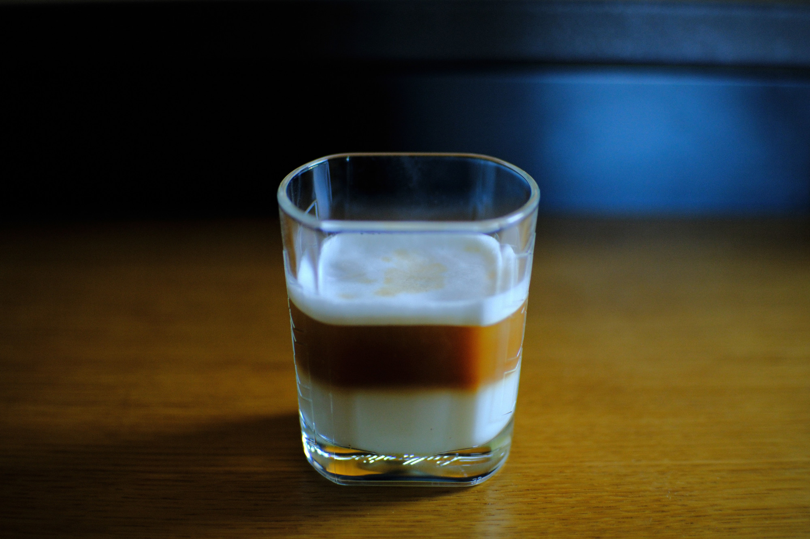
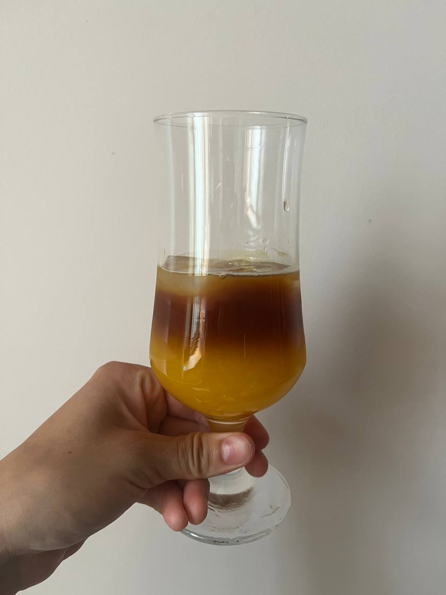
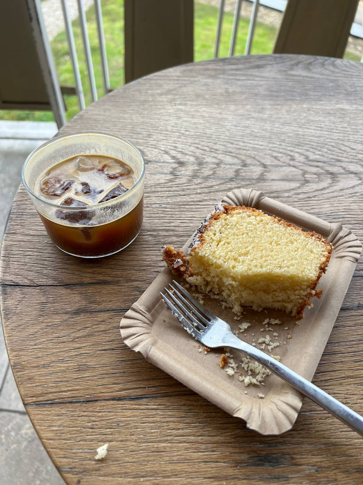

---
tags:
  - 10 минут
  - На одного
description:
---
# Кофе

Самые простые и вкусные рецепты кофе в одной статье.

## Пару слов о подготовке

**Зерно**.

**Свежий помол**.

**Жесткость воды**.

**Температура**.

## Фильтр кофе

Название говорит за себя - это отфильтрованный кофе.

## Кофе в джезве

Джезва один из самых древних способов заваривания кофе.

## Эспрессо

Для хорошего эспрессо нужна кофе машина., т.к. эспрессо - это кофе под давлением, es presso. Это кофе, полученный путём прохождения горячей воды под давлением через фильтр с молотым кофе. Эспрессо отличает наличие пенки. Она называется крема — это пенка на поверхности эспрессо, которая образовалась во время экстракции.

Дома сделать эспрессо довольно проблематично, т.к. для этого нужно покупать кофемашину, автоматическую или более профессиональную как в кафе. Для этого нужны деньги и свободное место. Но сейчас появляются потративные решения, например, бред Wacaco. Это небольшой цилиндр, где ты вручную создаешь давление и проливаешь кофе. Но суть одна -- без давления нет эспрессо.

- Зерно - гр
- Вода - мл

## Капучино

<figure markdown="span">
  
  <figcaption>Капучино</figcaption>
</figure>

- Эспрессо 1 порция
- Молоко 100 мл
- Сироп по вкусу

## Латте

<figure markdown="span">
  
  <figcaption>Латте с сиропом</figcaption>
</figure>

- Эспрессо 1 порция
- Молоко 200 мл

## Холодный кофе

### Айс кофе

Обычный кофе со льдом. 

- Фильтр кофе 1 порция
- Лед 1 стакан
- Сироп по вкусу

Сделай фильтр кофе или кофе в джезве. Добавь в бокал кубики льда и налей кофе. Можно добавить любой подходящий к кофе сироп.

### Колдбрю

Это холодный способ заварки кофе. 

- Молотый кофе 55 гр
- Вода 1 л

Залить в чистую ёмкость (кувшин или бутылка, да хоть бы и кастрюля), оставить на ночь, минимум на 5 часов. С утра процедить и можно наслаждаться вкусным холодным кофе. Такой кофе тоже можно комбинировать со льдом, холодным молоком, сиропами.

### Бамбл с апельсиновым соком

<figure markdown="span">
  
  <figcaption>Бамбл с апельсиновым соком</figcaption>
</figure>

- Апельсин 1 шт
- Кофе 1 порция
- Лед 1 стакан

Нам нужен готовый кофе. Лучше всего подойдет фильтр или эспрессо. Эспрессо более плотный, будет более фактурное и красивое разделение слоев, с фильтром скорее всего смешается полностью, но вкус всё равно будет на ура.

Соковыжималкой давим сок одного апельсина (или грейпфрута, тоже вкусно). 

В стакан кладем лед. Если хочешь сироп, добавляй его сейчас.

Наливай в прозрачный стакан сначала сок, потом аккуратно кофе. Если налил аккуратно, а кофе фактурный и плотный, увидишь разделение на слои. 

### Эспрессо тоник

<figure markdown="span">
  
  <figcaption>Эспрессо тоник</figcaption>
</figure>

- Тоник 150 мл
- Кофе 30 мл эспрессо или 100 мл фильтр 
- Лед

Это летний охлаждающий напиток, аналогично бамблу, только вместо сока -- тоник. Ключевое в рецепте -- это много-много льда.

В высокий стакан добавляем лед, доливаем почти до краев тоником, оставляя место под кофе. Мне нравится со швепсом со вкусом грейпфрута.

Наливаем порцию эспрессо (нет эспрессо - лей фильтр кофе, что уж).