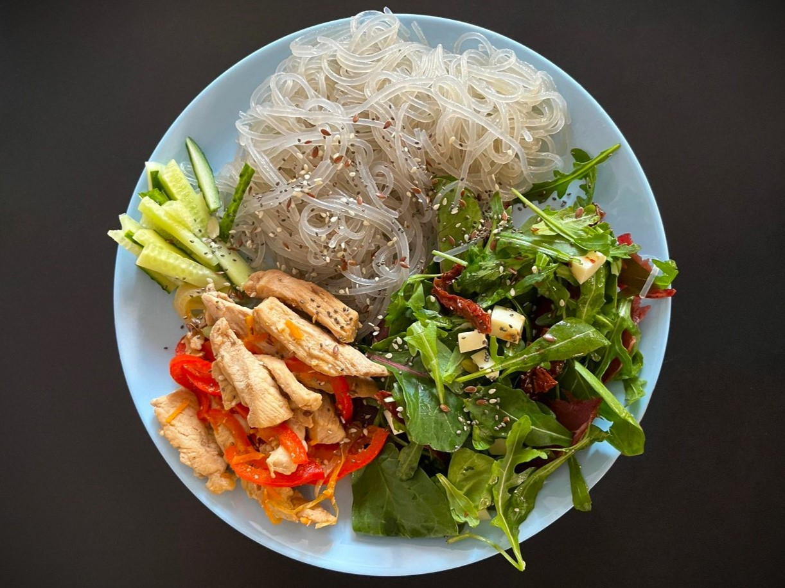

---
tags:
  - 20 минут
  - На двоих
  - Без техники
description:
---
# Фунчоза с курицей и овощами

<figure markdown="span">
  
  <figcaption>Фунчоза с курицей и овощами с дрессингом из шпината и рукколы</figcaption>
</figure>

Супер быстрый вариант ужина из стеклянной лапши с курицей и овощами. 

## Инвентарь

- сковорода
- кастрюля

## Ингредиенты

- Фунчоза 2 порции или 150-200 грамм (70-100 гр на человека)
- Куриное филе 1 шт
- Перец болгарский 1/2 шт
- Морковь 1/2 шт
- Кунжут 1 ч л
- Соль 1/2 ч л
- Перец черный 
- Сухой чесной
- Растительное масло для жарки

## Способ приготовления

1. Курицу нарезаешь мелкими кусочками, обжариваешь небольшими порциями на сильном огне, чтобы запечатать сок. 
1.  Морковь натри на терке, перец порежь соломкой. Как только из курицы начинает выделяться влага (характерный звук испаряющейся воды на раскаленной сковороде), снижаешь огонь и тушишь с морковью и перцем минут пять. Добавь соль, перец, сухой чеснок по вкусу.
1. Фунчозу отвариваешь по рецепту на упаковке. Она обычно варится буквально пару минут. После того, как сольешь воду, добавь немного масла, чтобы лапша не слиплась. Я люблю добавлять сливочное, мне так вкуснее.
1. В принципе, всё. Красиво выкладывай на тарелку, можешь дополнить любым овощным салатом или зеленью, чтобы было более сбалансированно. Сверху посыпь блюдо кунжутом.

Приятного аппетита!