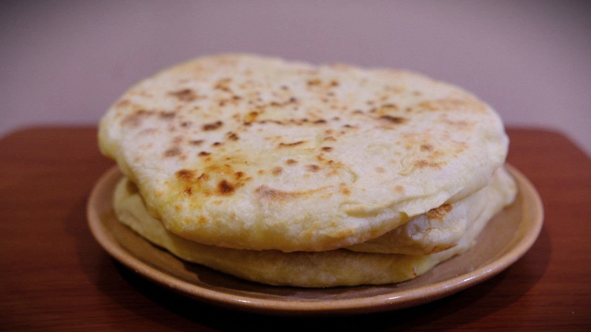

---
tags:
  - 15 минут
  - На двоих
  - Без техники
description:
---
# Хачапури на сковороде

<figure markdown="span">
  
  <figcaption>Домашние хачапури на сковороде</figcaption>
</figure>

Быстрый и тёплый вариант хачапури, который можно приготовить на обычной сковороде. Тесто нежное, сырная начинка тянется — прекрасно для завтрака или лёгкого ужина.

## Инвентарь

- Сковорода диаметром 22–26 см
- Миска для теста
- Скалка (можно обойтись руками)
- Лопатка
- Тёрка для сыра
- Нож и разделочная доска

## Ингредиенты

### Тесто

- Мука 250 г
- Кефир или густой йогурт 200 мл
- Яйцо 1 шт
- Разрыхлитель 1 ч л
- Соль 1/2 ч л
- Растительное масло 1 ст л + немного для жарки

### Начинка

- Сулугуни или моцарелла 200 г
- Фета или брынза 50 г (по желанию)

## Способ приготовления

1. В миске смешай кефир, яйцо, соль и растительное масло. Добавь муку с разрыхлителем и замеси мягкое, слегка липнущее тесто. Если нужно, подсыпь чуть муки.
2. Накрой тесто и дай ему отдохнуть 10–15 минут — так оно станет пластичнее.
3. Натри сыры на тёрке и хорошо перемешай.
4. Раздели тесто на 2 части. Раскатай каждую в кружок диаметром примерно 20–22 см.
5. В центр кружка выложи треть начинки, оставляя по краю 2–3 см. Подними края и защипни, чтобы получился мешочек. Аккуратно расплющи мешочек в лепёшку, чтобы начинка равномерно распределилась.
6. Разогрей сковороду на среднем огне, смажь тонким слоем масла. Выложи хачапури швом вниз и жарь 4–6 минут до золотистой корочки.
7. Переверни на другую сторону, убавь огонь до малого, накрой крышкой и жарь ещё 4–6 минут, чтобы тесто пропеклось внутри.
8. Перед подачей положи кусочек сливочного масла сверху и дай хачапури немного отдохнуть — сыр станет ещё тягучее.

Приятного аппетита!