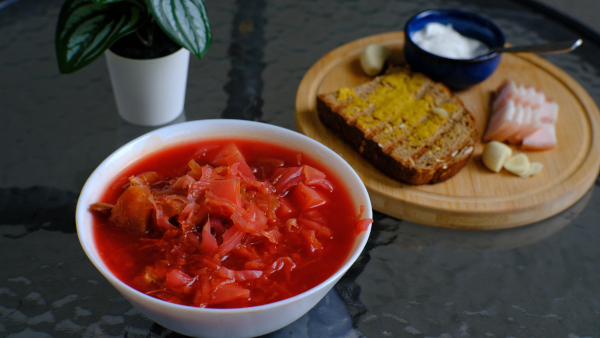
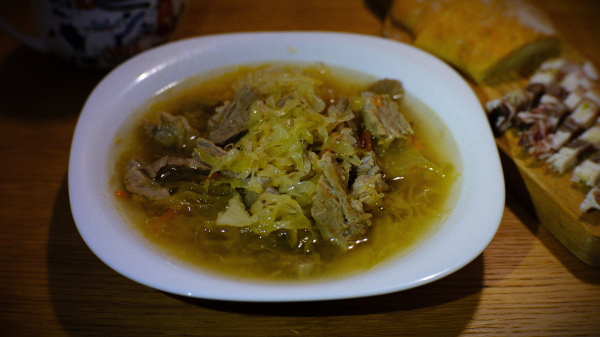

---
hide:
  - feedback
---
# Супы

Суп — это так по‑домашнему уютно и вкусно. Собрал ингредиенты вместе, дал повариться — и готово. 

Чтобы сделать вкус глубже и насыщеннее, можно предварительно сварить бульон на кости на медленном огне, добавив коренья, а овощи можно припечь. Не бойся экспериментировать с травами, специями и добавками — они делают суп "своим". 

А еще супы бывают холодными, что идеально подходит для жаркого лета.

-   [Мясной бульон](bouillon.md)

    ---

    

-   [Борщ](borsch.md)

    ---

    

-   [Щи](shi.md)

    ---

    

